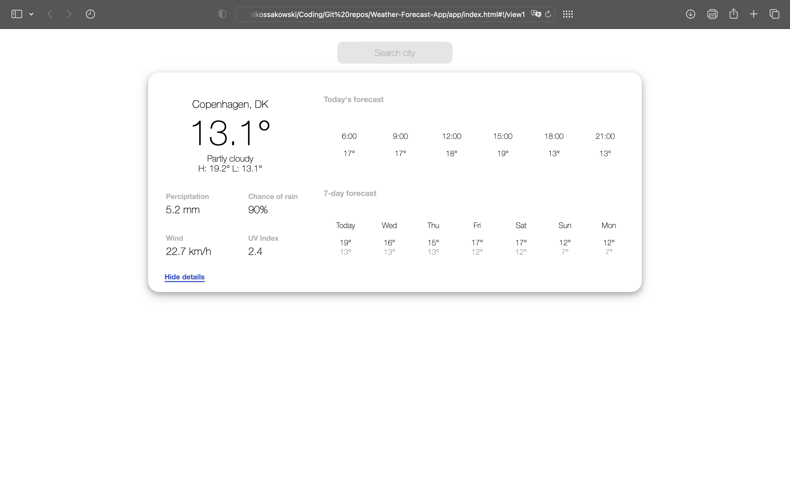

# Weather Forecast App

This repository contains a very basic setup of an AngularJS app for viewing the weather forecast of a chosen city. The data is obtained through the [Open-Meteo weather forecast API](https://open-meteo.com/en/docs).

## UI

The app has a very simple UI implemented. The idea was to display all of the neccessary information as simply and concisely as possible.

**General view**


**Detailed view**



## Getting Started

To get you started simply clone the repository and install the dependencies:

```
npm install
```

Once you have installed the dependencies you can start the local development environment with: 

```
npm start
```


Once started navigate to the app at [`http://localhost:8000`](http://localhost:8000).

