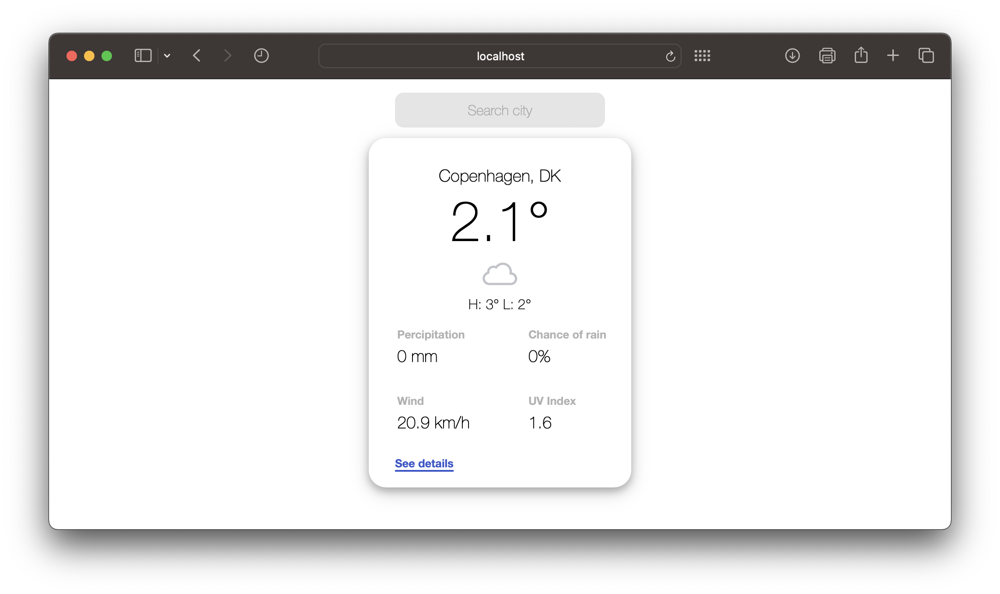

# Weather Forecast App

This repository contains a very basic setup of an AngularJS app for viewing the weather forecast of a chosen city.

## App description

The app has a very simple UI. The idea is to display all of the neccessary information as simply and concisely as possible.

### Weather Forecast API

The weather information is obtained via [Open-Meteo weather forecast API](https://open-meteo.com/en/docs).

### UI

Weather information for a chosen city is shown in a card format.

#### Main view

The main view displays all the essentials, so that the you get an overview at a glance.

<kbd>
  
</kbd>

<br>

#### Detailed view

The detailed view presents additional information for the 24-hour forecast with an interactive twist.

<kbd>
  
</kbd>

<br><br>

As well as a 7-day forecast.

<kbd>
  
</kbd>

<br>

### Weather icons

This project uses [Meteocons](https://bas.dev/work/meteocons) designed by [Bas Milius](https://bas.dev/about).

## Getting Started

To get you started simply clone the repository and install the dependencies:

```
npm install
```

Once you have installed the dependencies you can start the local development environment with: 

```
npm start
```

Once started navigate to the app at [`http://localhost:8000`](http://localhost:8000).
